# Project documentation
Project acronym: *Nephio* \
Authors: 
- Bartłomiej Chwast
- Karol Wrona
- Konrad Krzemiński
- Sławomir Tenerowicz

Year, Group: 2023/2024 Group 3

## Contents list
- [1. Introduction](#1-introduction)
- [2. Theoretical background/technology stack](#2-theoretical-backgroundtechnology-stack)
- [3. Case study concept description](#3-case-study-concept-description)
- [4. Solution architecture](#4-solution-architecture)
- [5. Environment configuration description](#5-environment-configuration-description)
    - [5.1 AWS Infrastructure configuration](#51-aws-infrastructure-configuration)
    - [5.2 Sample Kubernetes workload](#52-sample-kubernetes-workload)
- [6. Installation method](#6-installation-method)
    - [6.1 Prepare EC2 on AWS](#61-prepare-ec2-on-aws)
    - [6.2 Prepare local Kubernetes cluster](#62-prepare-local-kubernetes-cluster)
- [7. Demo deployment steps:](#7-demo-deployment-steps)
    - [7.1 Registering repositories in Nephio](#71-registering-repositories-in-nephio)
    - [7.2 Applying deployment](#72-applying-deployment)
    - [7.3 Inspect deployments](#73-inspect-deployments)
    - [7.4 Modify deployment](#74-modify-deployment)
    - [7.5 Apply different deployment](#75-apply-different-deployment)
    - [7.6 Create new blueprint](#76-create-new-blueprint)
- [8. Summary – conclusions](#8-summary-–-conclusions)
- [9. References](#9-references)

## Content
## 1. Introduction

Nephio is a cloud-native intent automation platform built on Kubernetes, designed to simplify the deployment and management of multi-vendor cloud 
infrastructure and network functions across large-scale edge deployments. By focusing on automation, Nephio streamlines the full lifecycle management
of entities, from provisioning to updates and decommissioning. It encompasses both network functions and the underlying infrastructure required to 
support them, enabling automation that adapts to changing requirements. Nephio is vendor-agnostic, fostering an ecosystem for innovation while 
ensuring interoperability. Its Kubernetes-based approach leverages declarative intent with continuous reconciliation, enabling efficient and scalable
automation. Nephio aims to accelerate the onboarding of network functions to production and reduce the costs associated with cloud adoption, 
ultimately enhancing agility in delivering services to customers [^1].
This project aims at creating demo presenting Nephio capabilities.

## 2. Theoretical background/technology stack

### Nephio - What It is? 
    
Nephio is a project that uses Kubernetes to automatically handle network tasks in cloud settings. It makes it easier to manage cloud infrastructure from different providers by using cloud-native ideas. This ensures that network services can grow, bounce back from issues, and be nimble when being set up and used on a large scale. The main aim of Nephio is to make using cloud and network infrastructure simpler and cheaper.

### What problem does Nephio solves?

Technologies like distributed cloud help us use computing resources across different locations easily, through the internet. But, the traditional ways of setting up and managing these resources don't work well with these new, flexible cloud systems. They can't easily adjust to changes or handle the complex setups involving different providers and locations.

Nephio is a solution that makes this easier. It uses newer methods that are better at dealing with the complexities of setting up and managing network services and the cloud infrastructure they run on, even when these involve many different providers and locations. It focuses on initially setting everything up and then, using Kubernetes (a system for automating application deployment, scaling, and management), it makes sure that the network keeps running smoothly even if there are problems, needs to grow, or changes in the cloud services.

### How Nephio works? 
Nephio tackles the big challenge by focusing on two main solutions:

- It uses Kubernetes at each site as a consistent tool to set up and manage both the distributed cloud and the network services running on it. This means no matter where your resources are, you're using the same system to control them.
- It offers an automation system that uses Kubernetes' smart, self-correcting approach. This system also allows configurations to be easily handled by computers. This helps manage the complex setups without getting overwhelmed.

### The use of Kubernetes in Nephio

The diagram below shows a system where Kubernetes helps automate and manage a telecom stack in three parts: 
- 1) the cloud setup
- 2) network function resources
- 3) network function setup. 
Nephio aims to create flexible and open Kubernetes templates, called CRDs, for each part, following telecom standards.

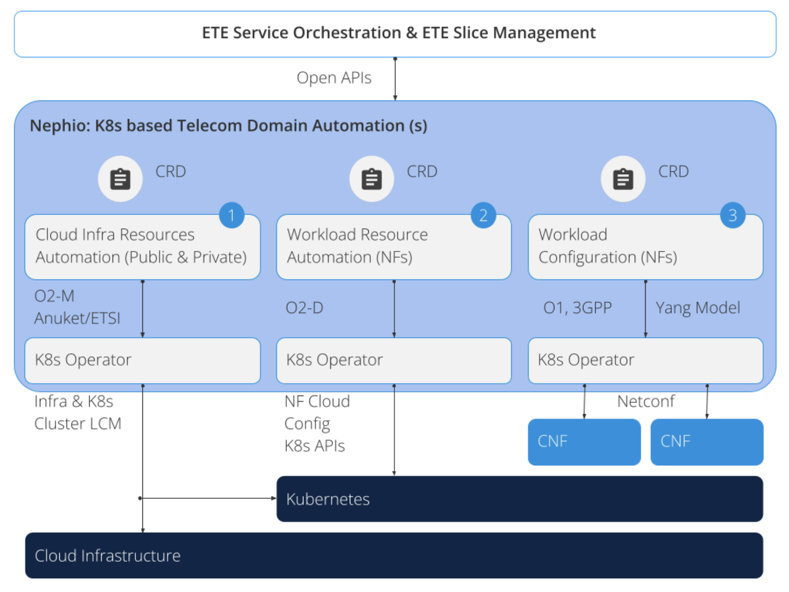

### Overview of Nephio’s functional components

The belows diagram shows a system designed to manage automation smoothly across different locations, it consists of two parts:
- At the bottom part of the diagram, there's a layer called “Intent Actuation” that works on each site's own computer clusters to make sure the system does what it's supposed to do. 
- The top part of the diagram shows a setup that uses Kubernetes (a tool to manage applications) to handle automation tasks more efficiently. This part is called the "Orchestration Cluster," and it's a special Kubernetes cluster set up just for managing the automation processes.

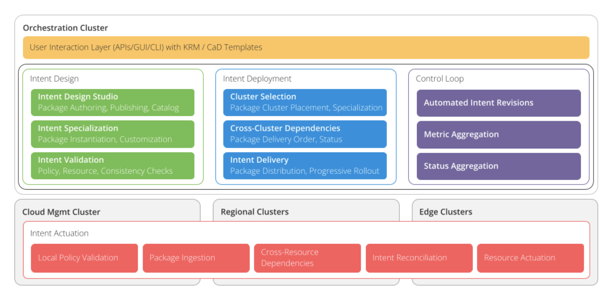

### Architecture 

The diagram below shows the recommended system architecture benefiting from Nephio, which is used to simplify the deployment and management of cloud infrastructure and network functions in large-scale deployments at the edge of the network. 

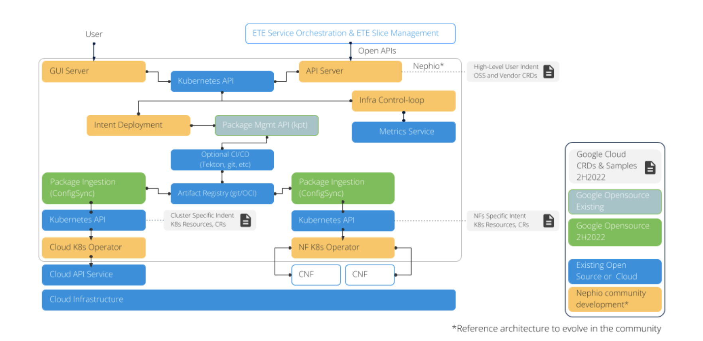

## 3. Case study concept description

Nephio is usually known for its role in advanced networking, especially in 5G networks and network functions. But in our project, we want to keep things simple. Let's imagine we just want to show how Nephio can be useful in different situations. So we're setting up a basic web application. But instead of anything fancy, we're just serving a simple webpage using Nginx. That simple case is enough for use case study as it's all about demonstrating how Nephio can be handy even in basic setups, not just in big, complicated networks.

----

In our demo application we will showcase the usage of Nephio in configuring kubernetes workloads across multiple kubernetes clusters operating with different cloud providers. 
We are going to use AWS Cloud, Azure Cloud, local Kubernetes cluster and possibly GCP.

The demo will consist of the following steps:
1. Developer creates new workload configuration in main repository
2. Nephio’s porch component will create new branches in each “edge” cluster repository
3. Those changes will be approved using Nephio’s gui
4. configsync component will update the workload configuration in each kubernetes cluster

## 4. Solution architecture

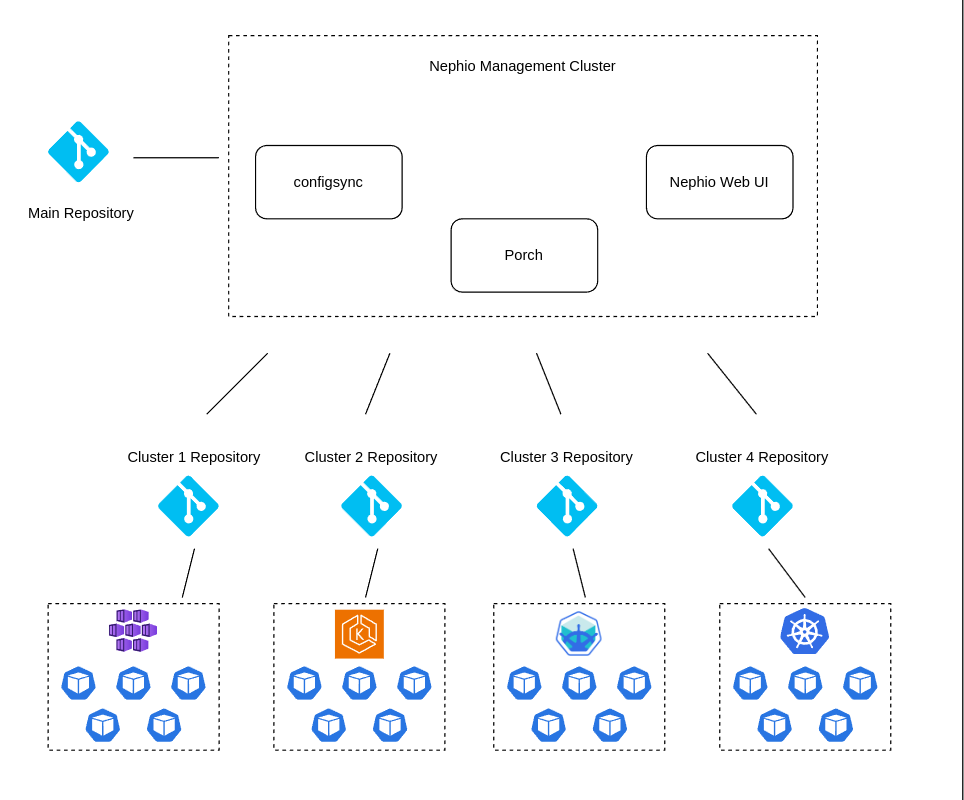

Our demo will be based on the following architecture:
- **Main repository** - the main repository on **GitHub** where the developer will create workload configuration
- **Edge repositories** - four repositories on **GitHub** for each edge cluster
- **Nephio management cluster** - a **microk8s** cluster based on **AWS EC2** where Nephio components will be deployed
- **Edge clusters**:
  - **microk8s** cluster based on **Azure VM** in **Azure Cloud**
  - **microk8s** cluster based on **AWS EC2** in **AWS Cloud**
  - **Local Kubernetes** cluster based on **minikube**
  - **GCP GKE** cluster based on **GCP VM** in **GCP**

Our goal is to present how Nephio can be used to manage workload configuration across various cloud providers and local Kubernetes clusters.
However, we are aware of possible limitations in terms of resources and costs, so we will focus on having at least two edge clusters.
One of them will be a local Kubernetes cluster, and the second one will be an **AWS** cluster.

## 5. Environment configuration description

### 5.1 AWS Infrastructure configuration

```terraform
terraform {
  required_providers {
    aws = {
      source  = "hashicorp/aws"
      version = "~> 4.16"
    }
  }

  required_version = ">= 1.2.0"
}

provider "aws" {
  region = "us-east-1"
}

resource "aws_security_group" "nephio-sg" {
  name        = "nephio-sg"
  description = "Allow inbound traffic"

  ingress {
    protocol = "tcp"
    from_port = 0
    to_port = 65535
    cidr_blocks   = ["0.0.0.0/0"]
  }

  egress {
    from_port        = 0
    to_port          = 0
    protocol         = "-1"
    cidr_blocks      = ["0.0.0.0/0"]
    ipv6_cidr_blocks = ["::/0"]
  }
}

resource "aws_instance" "nephio-master" {
  ami             = "ami-04b70fa74e45c3917"
  instance_type   = "t2.medium"
  key_name        = "vockey"
  security_groups = ["nephio-sg"]
  tags = {
    Name = "nephio-master"
  }
  root_block_device {
    volume_size = 20
  }
}

resource "aws_instance" "nephio-edge" {
  ami             = "ami-04b70fa74e45c3917"
  instance_type   = "t2.small"
  key_name        = "vockey"
  security_groups = ["nephio-sg"]
  tags = {
    Name = "nephio-edge-1"
  }
}
```

We will use the above terraform script to create two EC2 instances on AWS. One will be used as a *Master Cluster* and the second one as an *Edge Cluster*.
Additionally, we will create a security group allowing all inbound TCP traffic and all outbound traffic.

### 5.2 Sample Kubernetes workload

You can find a sample Kubernetes workloads which will be used in the demo in th `demo-workload` directory.
We will use a simple Kuard application used during Kubernetes labs and static html page served on Nginx.

## 6. Installation method

### Prerequisites:

#### 1. Ubuntu local machine (this guide is based on Ubuntu 22.04 LTS, if you are using different OS, please adjust the commands accordingly)
#### 2. Access to AWS account, with installed AWS CLI and configured credentials on your local machine
#### 3. Installed Terraform on your local machine 

### 6.1 Prepare EC2 on AWS

You can use prepared terraform scripts in the 'infrastructure/aws' directory.

Create at least two EC2 on AWS. One for *Master Cluster* and at least one for *Edge Cluster*. For our case *Master Clauses* is using t2.medium instance, and edge cluster is using t2.small instance. For simplicity the inboud rules accept all tcp traffic.

Installation guide for *Master Cluster*:

1. SSH to nephio-master EC2 instance
2. Copy `infrastructure/aws/nephio-common.sh` and `infrastructure/aws/nephio-master.sh` scripts to nephio-master EC2 instance
3. Make scripts executable `chmod +x nephio-common.sh nephio-master.sh`
4. Run initial installation script `./nephio-common.sh`
5. Run initial installation script `./nephio-master.sh`

Instalation guide for *Edge Cluster*

1. SSH to nephio-edge-1 EC2 instance
2. Copy `infrastructure/aws/nephio-common.sh` and `infrastructure/aws/nephio-edge-1.sh` scripts to nephio-edge-1 EC2 instance
3. Make scripts executable `chmod +x nephio-common.sh nephio-edge-1.sh`
4. Run initial installation script `./nephio-common.sh`
5. Run initial installation script `./nephio-edge-1.sh`
6. Copy contents of `infrastructure/local/rootsync.yaml` to *configsync/rootsync.yaml* file with replacing url in *spec.git.repo* to point to your edge repository
7. Apply *config-sync* package
> kpt live init configsync \
  kpt live apply configsync --reconcile-timeout=5m
    
### 6.2 Prepare local Kubernetes cluster

1. Copy `infrastructure/local/nephio-common.sh` and `infrastructure/local/nephio-edge-2.sh` scripts to your home directory
2. Make scripts executable `chmod +x nephio-common.sh nephio-edge-2.sh`
3. Run initial installation script `./nephio-common.sh`
4. Run initial installation script `./nephio-edge-2.sh`
5. Copy contents of `infrastructure/local/rootsync.yaml` to *configsync/rootsync.yaml* file with replacing url in *spec.git.repo* to point to your edge repository
6. Apply *config-sync* package
> kpt live init configsync \
  kpt live apply configsync --reconcile-timeout=5m

## 7. Demo deployment steps:

### 7.1 Registering repositories in Nephio

#### Open Nephio Web UI in your browser

It is available at `http://<nephio-master-public-ip>:7007`

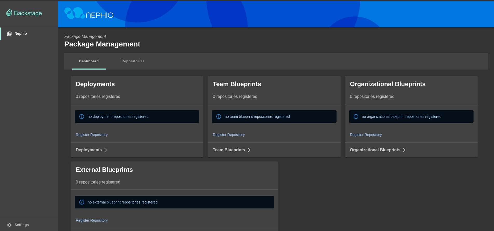

#### Register blueprints repository and deployment repositories `https://github.com/bchwast/nephio-edge-1.git`, `https://github.com/bchwast/nephio-edge-2.git`

* Click on `Register Repository` link in the **Team Blueprints** section
* Enter repository URL with packages (`https://github.com/bchwast/nephio-packages` in this demo) and click `Next` button
* Add authentication token for the repository (if needed) and click `Next` button
* Add repository description (if needed) and click `Next` button
* Choose `Team Blueprints` option and click `Next` button
* Click `Register Repository` button

After that you should see blueprints available in added repository.

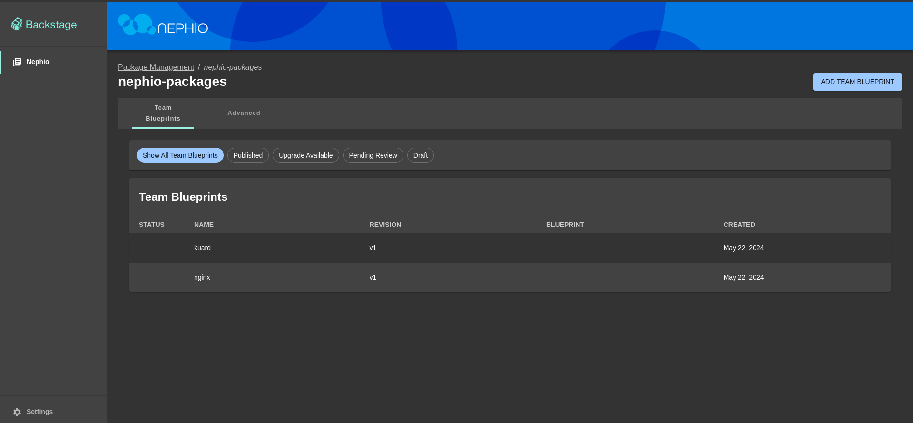

#### Register deployment repositories

* Go back to the main page
* Click on `Register Repository` link in the **Deployments** section
* Enter repository URL with deployment repository (`https://github.com/bchwast/nephio-edge-1` in this demo) and click `Next` button
* Add authentication token for the repository (if needed) and click `Next` button
* Add repository description (if needed) and click `Next` button
* Choose `Deployments` option and click `Next` button
* Click `Register Repository` button

After that you should see empty deployments' repository.


#### Repeat above steps for the second edge repository (`https://github.com/bchwast/nephio-edge-2` in this demo)

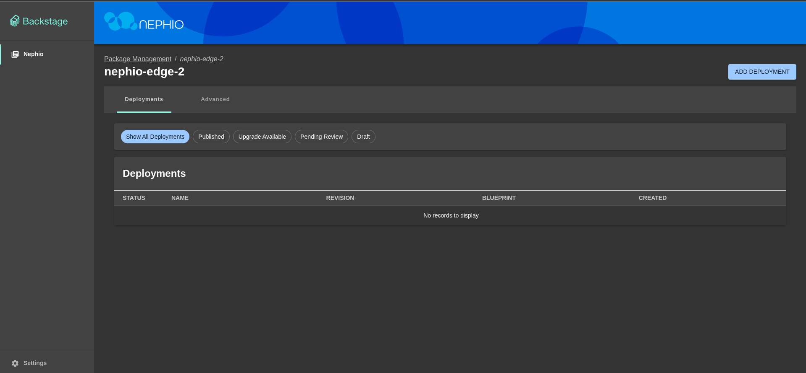

### 7.2 Applying deployment

#### Apply deployment for the first edge cluster (`nephio-edge-1`) on AWS

* Go to the `nephio-edge-1` deployment page
* Click on `Add Deployment` button
* Select `Create a new deployment by cloning a team blueprint`, leave `nephio-packages` as a source repository, select `kuard` blueprint and click `Next` button
* Add metadata for the deployment (if needed) and click `Next` button
* Change namespace (if needed) and click `Next` button
* Select whether to validate resources and click `Next` button
* Click `Create Deployment` button

In the background Nephio will create a new branch in the `nephio-edge-1` repository with the deployment configuration.

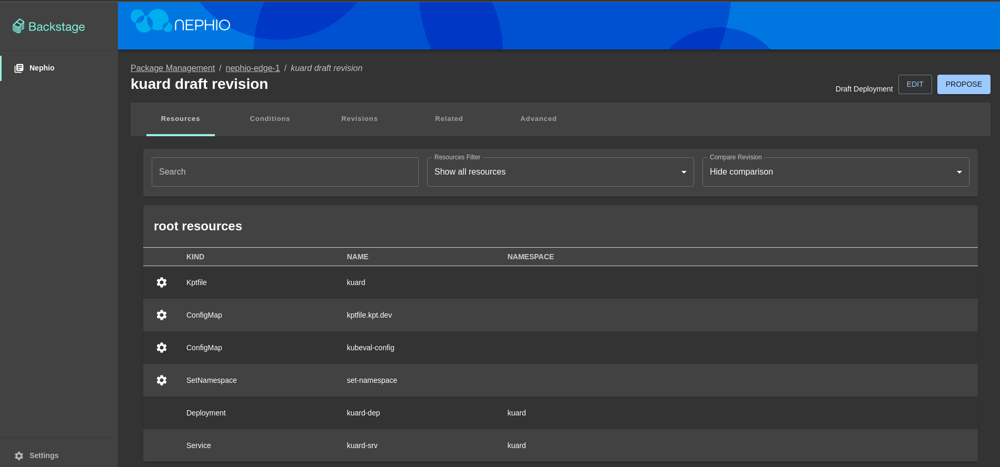

You can inspect proposed deployment and add changes if needed by clicking `Edit` button.

* Click `Propose` button to propose changes

In the background Nephio will create a pull request in the `nephio-edge-1` repository.

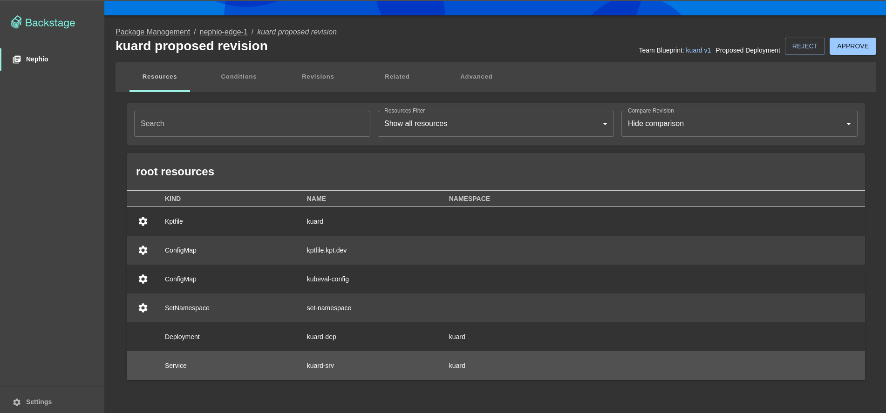

Second developer should now review proposed deployment and approve it or reject it by clicking appropriate button.

* Click `Approve` button to approve changes

In the background Nephio will merge pull request and apply deployment configuration to the edge cluster.

#### Apply deployment for the second edge cluster (`nephio-edge-2`) on your local machine

Repeat above steps for the second edge repository (`https://github.com/bchwast/nephio-edge-2` in this demo)

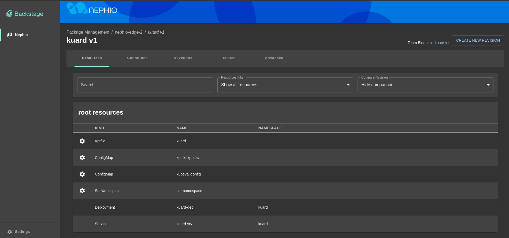

### 7.3 Inspect deployments

#### Inspect deployment on the first edge cluster (`nephio-edge-1`) on AWS

* SSH to the `nephio-edge-1` EC2 instance
* Check if deployment is running by executing `microk8s kubectl get pods -n kuard` command

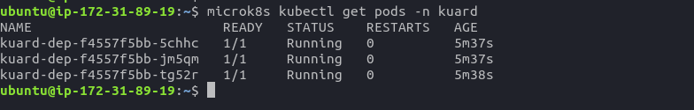

* Port forward service to access application
> microk8s kubectl port-forward --namespace=kuard --address 0.0.0.0 service/kuard-srv 8080:80 &
* Open browser and go to `http://<nephio-edge-1-public-ip>:8080` to see the application

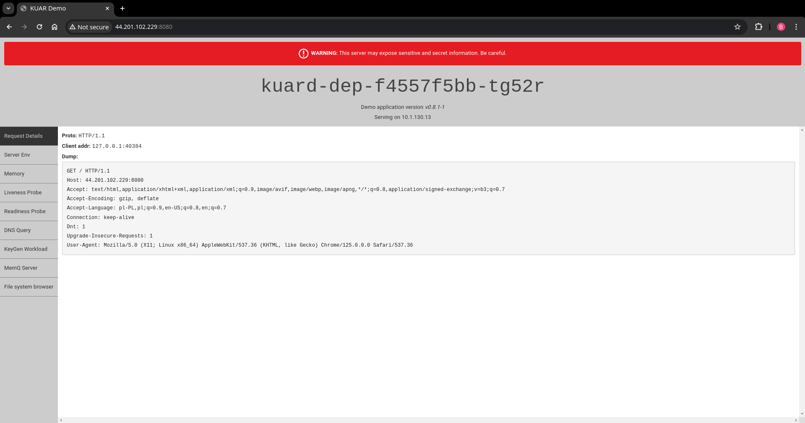

#### Inspect deployment on the second edge cluster (`nephio-edge-2`) on local machine

* Open terminal session on your local machine
* Check if deployment is running by executing `microk8s kubectl get pods -n kuard` command

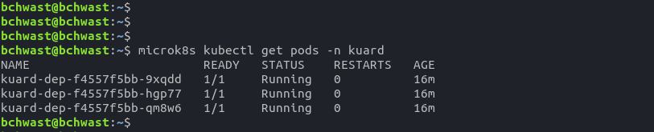

* Port forward service to access application
> microk8s kubectl port-forward --namespace=kuard --address localhost service/kuard-srv 8080:80 &
* Open browser and go to `http://localhost:8080` to see the application

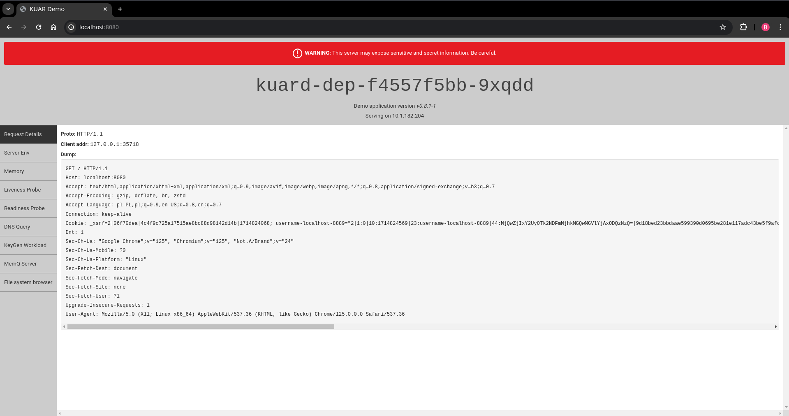

### 7.4 Modify deployment

#### Modify deployment on the first edge cluster (`nephio-edge-1`) on AWS

* Go to the `nephio-edge-1` deployment page
* Go to `kuard` deployment page
* Click `Create New Revision` button
* Click `Edit` button to modify deployment, enter changes and click `Save` button (In this demo we will change the number of replicas from 3 to 5)
* Click `Propose` button and then `Approve` button

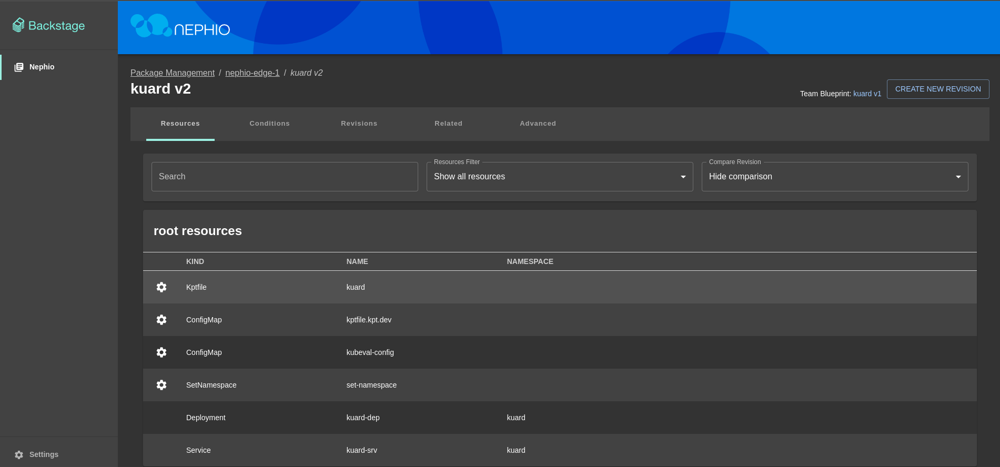

* SSH to the `nephio-edge-1` EC2 instance
* Check if deployment has been updated by executing `microk8s kubectl get pods -n kuard` command

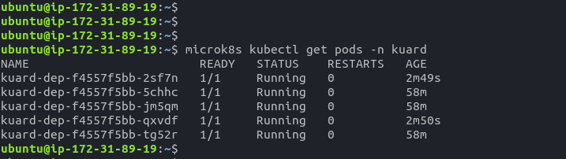

### 7.5 Apply different deployment

#### Apply second deployment on the first edge cluster (`nephio-edge-1`) on AWS

* Go to the `nephio-edge-1` deployment page
* Click on `Add Deployment` button
* Select `Create a new deployment by cloning a team blueprint`, leave `nephio-packages` as a source repository, select `nginx` blueprint and click `Next` button
* Add metadata for the deployment (if needed) and click `Next` button
* Change namespace (if needed) and click `Next` button
* Select whether to validate resources and click `Next` button
* Click `Create Deployment` button
* Click `Propose` button to propose changes
* Click `Approve` button to approve changes

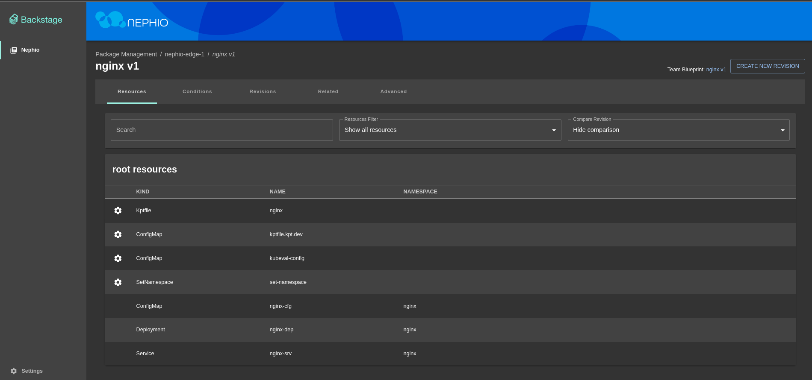

#### Inspect deployment on the first edge cluster (`nephio-edge-1`) on AWS

* SSH to the `nephio-edge-1` EC2 instance
* Check if deployment is running by executing `microk8s kubectl get pods -n nginx` command
* Check if previous deployment is running by executing `microk8s kubectl get pods -n kuard` command

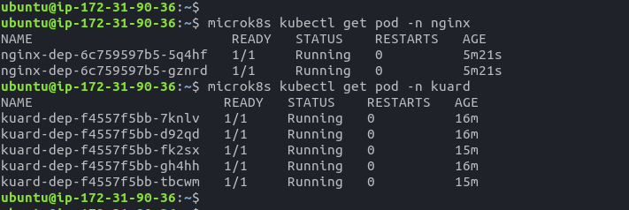

* Port forward service to access application
> microk8s kubectl port-forward --namespace=nginx --address 0.0.0.0 service/nginx-srv 8081:80 &
* Open browser and go to `http://<nephio-edge-1-public-ip>:8081` to see the application

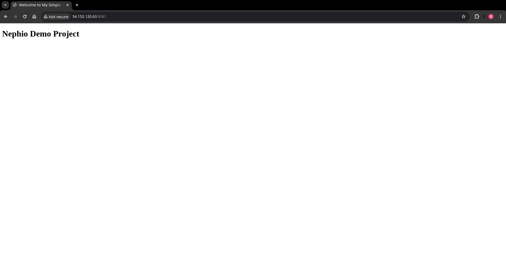

### 7.6 Create new blueprint

#### Create new blueprint in the `nephio-packages` repository


* Go to the `Team Blueprints` page
* Click on `Add Team Blueprint` button
* Select `Create a new team blueprint by cloning a team blueprint`, leave `nephio-packages` as a source and destination repository, select `nginx` blueprint and click `Next` button
* Add metadata for the deployment (if needed) and click `Next` button
* Change namespace (if needed) and click `Next` button
* Select whether to validate resources and click `Next` button
* Click `Edit` button to modify deployment, enter changes and click `Save` button (In this demo we will change the number of replicas from 2 to 10)
* Click `Propose` button to propose changes
* Click `Approve` button to approve changes

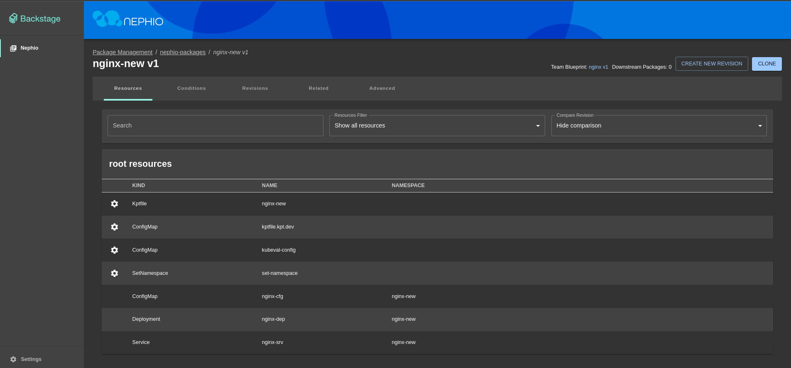

* Go back to the `Team Blueprints` page

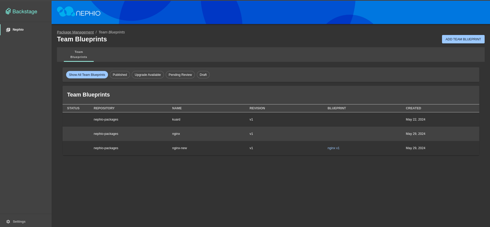

## 8. Summary – conclusions

The project aimed to showcase Nephio, a cloud-native intent automation platform built on Kubernetes, 
and its ability to manage and simplify multi-vendor cloud infrastructure and network functions. The demonstration involved setting up cloud environments. 
Terraform scripts were used to configure EC2 instances and necessary security settings.

In this project we conducted a study to explore Nephio technology and its capabilities. 

* We have presented the theoretical background of Nephio and its technology stack.
* We have created a demo showcasing how Nephio can be used to manage workload configuration across various cloud providers and local Kubernetes clusters. 
* We have successfully deployed a simple web application using Nginx and Kuard on AWS and local Kubernetes cluster. 
* We have also shown how to modify deployments and create new blueprints using Nephio Web UI.

Nephio components were successfully deployed on these clusters, establishing a functional management framework. 
Nephio effectively automated the deployment process, managed configurations, scaled applications, and maintained operations across different environments.

The project validated Nephio’s ability to simplify lifecycle management, enhance operational efficiency, and reduce costs associated with cloud infrastructure management. 
This demonstration highlighted Nephio's flexibility, interoperability, and efficiency in handling complex, multi-cloud setups.

We learned that Nephio is a powerful tool that can be used to automate the deployment and management of cloud infrastructure and network functions across large-scale edge deployments.
It is a vendor-agnostic solution that fosters an ecosystem for innovation while ensuring interoperability. 
Its Kubernetes-based approach leverages declarative intent with continuous reconciliation, enabling efficient and scalable automation. 
Nephio aims to accelerate the onboarding of network functions to production and reduce the costs associated with cloud adoption, ultimately enhancing agility in delivering services to customers.

## 9. References

[1]: [Learning with Nephio R1 - Episode 1 - Series Introduction](https://wiki.nephio.org/display/HOME/Learning+with+Nephio+R1+-+Episode+1+-+Series+Introduction)\
[2]: [Nephio - GitHub Repository](https://github.com/nephio-project)\
[3]: [AWS - Amazon Web Services](https://aws.amazon.com/)\
[4]: [Kubernetes](https://kubernetes.io/)\
[5]: [Terraform](https://www.terraform.io/)\
[6]: [Nginx](https://www.nginx.com/)\
[7]: [Kuard](https://github.com/kubernetes-up-and-running/kuard)\
[8]: [Kpt](https://kpt.dev/)\
[9]: [Microk8s](https://microk8s.io/)
